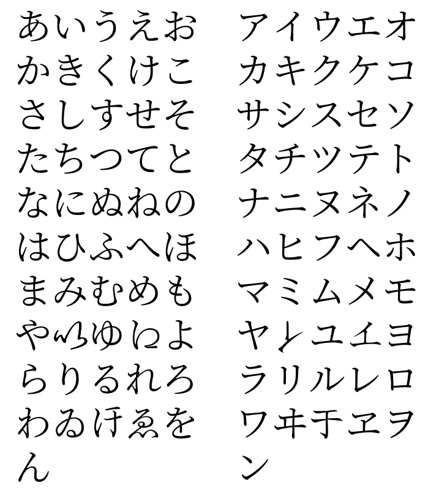

# 動詞の活用グループにおいて

## 背景
日本語の動詞の活用方法が今まであんまり理解していなっかたです。
正直、動詞の活用方法を彼女に説明する際頭の中は結構モヤモヤします。

幼い頃、お母さんは僕たち兄弟たちに厳しく日本語を教えました。補習校には通ってましたけど、記憶限り徹底的な日本語文法の教育は受けたことありません。

引いて、僕が会話等に実行していた動詞の活用においては、全部システムとルールを無視して学びました。

ゆえに、活用のルールを分かってなかったらもちろん、どんだけ日本語喋れても、彼女の文法学びには参考にはならない。

かてて加えて、最近は五十音図に興味を持ち出しました。なぜかというと、これが動詞活用に関係あるって聞いたからです。
関係の意味を理解せず、とりあえず五十音図の事自体を身につけました。

まあ、その道です。
それで、この記事では僕が見つけた日本語活用方法とその活用方法が五十音図にどう関係するかを紹介したいと思います。

## はじめに

この記事で紹介する動詞分類は３つです。

- 五段動詞（I型動詞、グループ１、強変化動詞）
- 一段動詞（II型動詞、グループ２、弱変化動詞）
- 不規則動詞（III動詞型、グループ３、カ行変格動詞、サ行変格動詞）

見分けかたに使う道具は五十音図です。紹介します

全ての辞書形動詞の最後の文字はウ段に当たる。

例えば:
| 辞書形　| 語末 |
| --- | --- |
| 食べる | る |
| 話す | す |
| 泳ぐ | ぐ |

## 見分け方

各グループはルールあります。そのルールを使ってどの動詞が当たるかを決断します。
考え方はこんな感じでいいと思います:

> 一番厳しいルールはグループ3。それからグループ2。最後にグループ1。なお、一番厳しいルールに当てなかったら、次のルールを確認する。その過程であたるグループを探します。

### グループ3　ー　不規則動詞

このグループのルールは下記です

>　「動詞の辞書形は『来る』それても『する』」

### グループ２　ー　一段動詞

このグループのルールは下記です

>「辞書形の動詞の語末が「る」」と「語末前の文字は「い段」、及び「え段」に当たる」

#### 例

| 辞書形　| 語末前の文字 | 語末前の文字の段 |
| --- | --- | --- |
| 食べる | べ | え |
| 植える | え | え |
| 痺る | び | い |
| 染みる | み | い |

### グループ１　ー　五段動詞

このグループのルールは下記です

>　ルール３とルール２に当たらない動詞はグループ１

#### 例

| 辞書形　|
| --- | 
| 貢ぐ |
| 起こる |
| 殺す |
| 言う |

## 活用

では、見分けかたを紹介しましたので、次に各グループの活用方法を説明したいと思います。

説明したい活用形は六つ

|　形　|
| --- | 
| ない形 |
| ます形 |
| 辞書形 |
| ば形 （条件形）|
| 意向形（意志形／よう形）|
| て形|

グループごとに活用を例と一緒に紹介します

### グループ３

|　形　|　来る　|　する　|　
| --- | --- | --- | 
| ない形 | 来ない | しない |
| ます形 | 来ます | します |
| 辞書形 | 来る |　する |
| ば形 （条件形）| 来れば | すれば |
| 意向形（意志形／よう形）| 来よう | しよう |
| て形　| 来て　| して |

グループ３には只二つの動詞があるので頑張って暗記してください

### グループ２

グループ２の活用は結構簡単です

辞書形を基づき語末の「る」省いて、活用形によって然るべく切り替えます

|　形　|　食べる　|　染みる　|　
| --- | --- | --- | 
| ない形 | 食べない | 染みない |
| ます形 | 食べます | 染みます |
| 辞書形 | 食べる |　染みる |
| ば形 （条件形）| 食べれば |　染みれば |
| 意向形（意志形／よう形）| 食べよう | 染みよう |
| て形　| 食べて　| 染みて |

### グループ３

グループ３の活用は結構簡単です

辞書形を基づき語末の「る」省いて、活用形によって然るべく切り替えます

|　形　|　食べる　|　染みる　|　
| --- | --- | --- | 
| ない形 | 食べない | 染みない |
| ます形 | 食べます | 染みます |
| 辞書形 | 食べる |　染みる |
| ば形 （条件形）| 食べれば |　染みれば |
| 意向形（意志形／よう形）| 食べよう | 染みよう |
| て形　| 食べて　| 染みて |

# 参照

見分け方
https://chasoblogjapan.com/doushi-group/

活用
https://chasoblogjapan.com/doushi-katsuyo/

子音動詞は何？
母音動詞は何？
https://www.hamasensei.com/doushinoshurui/

